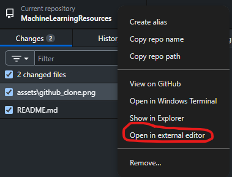
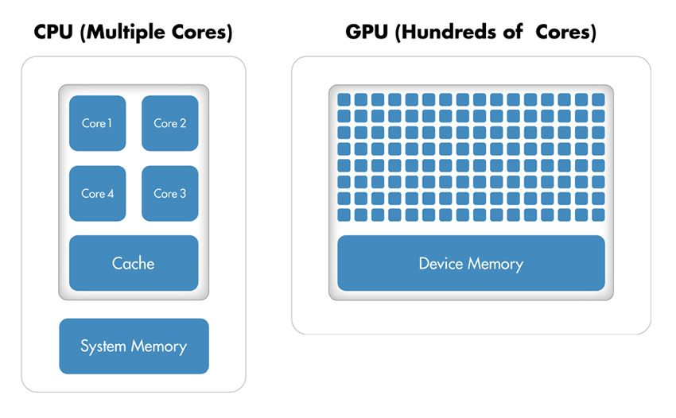
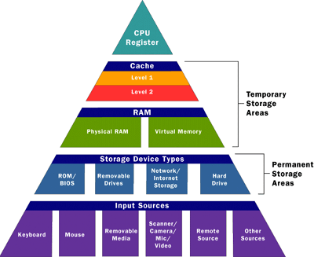

# Guide to Machine Learning: Setup and Resources

Machine learning is a powerful tool that is mystified in popular media. However, with some basic mathematics and statistics it can become understandable and engineerable!

## Quick Start

Start here, then open `basic_ml_code_and_concepts.ipynb` to explore concepts and code.

1. Install Python: https://www.python.org/downloads/
2. Install VS Code: https://code.visualstudio.com/
3. Install GitHub Desktop: https://desktop.github.com/download/
4. Clone this repository with GitHub Desktop


5. (Optional) Set your default editor to VS Code


6. Open the repository folder in VS Code



7. Open a terminal in VS Code (Terminal > New Terminal), then install dependencies:

Python is sometimes accessed by `python` or `py` on Windows.

```
python -m pip install -r requirements.txt
```

8. Open `basic_ml_code_and_concepts.ipynb` in VS Code and run the cells (Run All). If it runs, you’re ready to go.

## Repository Overview

- `basic_ml_code_and_concepts.ipynb`: Guided notebook with core concepts and runnable examples
- `assets/`: Images used throughout this guide
- `data/`: Sample datasets (e.g., MNIST files)
- `saved_images/`: Images saved by example code
- `transformers_workshop/`: Additional workshop materials (if present)

## What is Machine Learning?

Machine learning (ML) is primarily the use of data to fit or train an algorithm to describe that “type” of data generally. It’s called Machine *Learning* because there are often numerical parameters that are adjusted (*learned*) throughout an optimization scheme. It is best to resort to ML when

- the underlying physical process behind the data is unknown, complicated, or not directly computable
- there are many examples of this process to train a model with

Importantly:

- ML can be used to build predictive models from data
- ML can be used to classify or describe inputs
- ML can be used to condense and process data
- ML can identify key features from your data and guide your hypotheses generation
- ML can generalize complicated physical processes that are (currently) impossible to simulate fully

However, ML is a very broad discipline; *there is no one-size-fits-all model*. Various algorithms are designed to make predictions or decisions based on input data and the output is scored to better inform the model in the future.  Some ML methods have closed-form solutions, some learn through strategic trial and error, and others can be guided by gradient descent. Regardless of the model, more data is generally better.

Thus, if 

- there is not much available data
- synthetic data cannot be generated or is not useful
- the physical underlying process is well understood and computable

[ML might not be the best approach for the problem](https://docs.aws.amazon.com/machine-learning/latest/dg/when-to-use-machine-learning.html).

## What should I learn before doing any ML? (to make life easier)

### Math and Statistics

Key concepts
- Derivatives, gradients
- Vector and Matrix operations
    - Matrix manipulation
    - indexing, slicing, know that matrix sizes are described by (`number of rows` x `number of columns`)
- Descriptive statistics
    - mean, median, mode, standard deviation, etc.
- Popular metrics
    - Precision, Recall, Accuracy, F1, MCC, etc.
- Basic probability theory
    - Expected value, variance
- Error, bias and variance tradeoff
- Distributions
    - discrete, continuous, central limit theorem
- A grasp on “dimensions”
- Data as features

## Python

Python is a popular programming language for ML due to its ease of use, a large selection of libraries and frameworks specifically designed for ML, and its ability to integrate with other languages such as C++ and R. An ML engineer will use many packages throughout a project

### Installing IDEs

An Integrated Development Environment (IDE) is where the “magic” happens. These are applications that let you write and run Python code with helpful features. The two most popular IDEs are PyCharm and Visual Studio Code (VS Code). The pros and cons are summarized nicely in [this blog post](https://blog.logrocket.com/pycharm-vs-vscode/).

In general, VS Code’s Python features are excellent. You can run Python and Jupyter notebooks directly in VS Code, and it has many helpful extensions.

Installing:

[Python in VS Code](https://code.visualstudio.com/docs/python/python-tutorial)

[PyCharm](https://www.jetbrains.com/help/pycharm/quick-start-guide.html)

**[Cursor](https://cursor.com/)**

Nowadays there are enhanced versions of VS Code with AI integrations (autocomplete or chat in the IDE). You can also install the GitHub Copilot extension (free for students) in VS Code. If you code often, these tools can speed up repetitive typing and boilerplate.

## Types of Hardware

An ML engineer's main partner in crime is their computer. Computers consist of several components, each with its own role in the functioning of the system. Here is a brief summary of some of the most important components and their relationship to each other:

1. CPU (Central Processing Unit) - This is the brain of the computer and is responsible for executing instructions. It performs the bulk of the computational tasks and coordinates the work of other components.

2. GPU (Graphics Processing Unit) - This is a specialized processor designed to handle graphics and video tasks. It offloads some of the processing tasks from the CPU, making it possible to handle more complex graphics. GPUs are particularly useful for ML tasks because they are optimized for performing the same calculations repeatedly in parallel, which is a common characteristic of many ML algorithms. This allows for much faster training times for models compared to using just the CPU. 



Reference: [GPU programming in MATLAB](https://www.mathworks.com/company/newsletters/articles/gpu-programming-in-matlab.html)

3. Hard Drive - This is the primary storage component of the computer. It stores data and program files that are not currently in use.
4. VRAM (Video Random Access Memory) - This is the memory on a graphics card that stores data for rendering images on the screen. It is faster and more efficient than regular RAM for graphics tasks.
5. RAM (Random Access Memory) - This is the primary memory of the computer and used for temporarily storing data and instructions that are currently in use. RAM is much faster than hard drive storage but less expensive than VRAM.
6. Cache - This is a small amount of memory that is used to store frequently used data, making it quickly accessible to the CPU. It helps to speed up processing times.
7. Registry - This is a database that stores configuration settings and options for the operating system and applications. It is used to keep track of all the software installed on the computer and their settings.

The hierarchy of memory starts with the CPU cache, which is the fastest but smallest storage unit. Then, it moves on to RAM, which is larger but slower than cache. The hard drive is even larger but slower than RAM, and VRAM is faster than both RAM and hard drive but smaller in size.




Reference: [Types of computer memory (Seeed Studio blog)](https://www.seeedstudio.com/blog/2020/11/25/types-of-computer-memory-ram-rom-and-secondary-memory/)


Optimizing these systems to work together involves maximizing the amount of data that can be stored in the cache and RAM, minimizing the number of times data must be accessed from the hard drive or VRAM, and ensuring that all components are working efficiently. This can be achieved through techniques such as memory management, data caching, and optimizing algorithms and software for the specific hardware architecture of the computer; some of which are discussed below.

Additionally, there is a specialized resource for ML called TPUs. TPUs, or Tensor Processing Units, are specialized hardware accelerators developed by Google. They are designed to efficiently perform the matrix operations that are central to deep learning computations. TPUs are optimized for Google's TensorFlow framework and can provide significant speedup over traditional CPUs or GPUs, particularly for large-scale ML tasks. While TPUs are phenomenally fast in niche conditions, GPUs are by far the more extensive resource for training ML models. It is possible that TPUs will gain some popularity in the future, so it is good to be aware of them. However, as someone new to ML do not worry about utilizing them.

## Learning resources

A compilation of resources that give a foundation of data science knowledge in general. There is a fairly detailed description of concepts that current projects in the lab use below, but are bound to be confusing to people new to ML. Please use these resources as needed to make concepts more understandable. There is no expectation for going through a certain amount of these to start ML projects in the lab, but the more general data science concepts you know the more intuitive ML becomes and the better ML engineer you will be.

#### **High-Level**

Python script with basic components, click to view in browser

[intro_to_python.py](https://s3-us-west-2.amazonaws.com/secure.notion-static.com/6a163c46-d8d4-477a-8fef-4a3dd014a480/intro_to_python.py)

Beginner Python, approximately equivalent to **BINF690 Programming for Bioinformatics**

[Learn Python - Full Course for Beginners [Tutorial]](https://www.youtube.com/watch?v=rfscVS0vtbw)

Stat Quest is a channel with well-received overviews of data science, statistics, and ML concepts

[StatQuest with Josh Starmer](https://www.youtube.com/@statquest)

Summary of Calculus Video, for touching up on calculus concepts

[Understand Calculus in 35 Minutes](https://www.youtube.com/watch?v=WsQQvHm4lSw)

Professors Dave’s linear algebra series is a great overview and put in much simpler terms than Dr. Strang's below, probably more friendly to people without an extensive math background if needing to touch upon specific topics regarding vectors and matrices

[Linear Algebra](https://www.youtube.com/playlist?list=PLybg94GvOJ9En46TNCXL2n6SiqRc_iMB8)

Jay Alammar’s blog is **legendary** for his insightful visualizations and beginner-friendly wording

[Jay Alammar – Visualizing machine learning one concept at a time.](https://jalammar.github.io/)

#### **In-Depth**

MIT Open Courseware Linear Algebra courses - **Dr. Gilbert Strang is the GOAT linear algebra professor**, but requires decent mathematical background

[MIT 18.06SC Linear Algebra, Fall 2011](https://www.youtube.com/playlist?list=PL221E2BBF13BECF6C)

[MIT 18.065 Matrix Methods in Data Analysis, Signal Processing, and Machine Learning, Spring 2018](https://www.youtube.com/playlist?list=PLUl4u3cNGP63oMNUHXqIUcrkS2PivhN3k)

[A 2020 Vision of Linear Algebra, Spring 2020](https://www.youtube.com/playlist?list=PLUl4u3cNGP61iQEFiWLE21EJCxwmWvvek)

**MIT Open Courseware** also offers a variety of courses in the ML space, as well as a ton of math courses for those needing to dive deeper into subjects like calculus

[Search | MIT OpenCourseWare | Free Online Course Materials](https://ocw.mit.edu/search/?q=machine+learning)

Excellent linear algebra series for visual learners by 3Blue1Brown

[Essence of linear algebra](https://www.youtube.com/playlist?list=PLZHQObOWTQDPD3MizzM2xVFitgF8hE_ab)

[Francois Fleuret’s](https://fleuret.org/francois/) deep learning slides and lectures. **These are really really good!**

[UNIGE 14x050 – Deep Learning](https://fleuret.org/dlc/)


## Python Packages

[Pip](https://pypi.org/project/pip/)

**Pip** is Python’s most popular package manager, essential for installing, upgrading, and managing libraries (and their dependencies) in your machine learning environment. It is bundled with Python 3.4+ and is also available for older versions.

### Key Features

- **Simple Installation:** Install any package from the [Python Package Index (PyPI)](https://pypi.org/).
- **Dependency Management:** Automatically handles package dependencies.
- **Version Control:** Easily upgrade or downgrade packages.
- **Requirements Files:** Recreate environments or share dependencies using a text file.


### Basic Commands

- **Install a Package:**
    
    ```bash
    pip install package_name
    
    ```
    
- **Upgrade a Package:**
    
    ```bash
    pip install package_name --upgrade
    
    ```
    
- **Install from a Requirements File:**
    
    ```bash
    pip install -r requirements.txt
    
    ```
    
- **Freeze Installed Packages:**
    
    Generate a list of installed packages and their versions (useful for creating a `requirements.txt`):
    
    ```bash
    pip freeze > requirements.txt
    
    ```
    

*Example: Installing and Upgrading NumPy*

```bash
# Install NumPy
pip install numpy

# Later, upgrade to the latest version
pip install numpy --upgrade # or -U

```

To continue with the guide move on to `basic_ml_code_and_concepts.ipynb`. Python notebooks (`.ipynb` files) can be double clicked to entire once inside VScode.