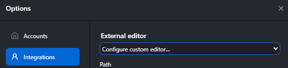

# Resources for learning ML

Machine learning is a powerful tool that is mystified in popular media. However, with some basic mathematics and statistics it can become understandable and engineerable!

## Getting started

The `guide_to_ml.ipynb` is a great place to start. However, if you have litle to no coding experience you may need to install Python and the necessary packages to run the code correctly (as well as an IDE to look at the code!)

Download Python [here](https://www.python.org/downloads/)

Download VScode [here](https://code.visualstudio.com/)

Download GitHub desktop [here](https://desktop.github.com/download/)

Open GitHub desktop

Click this to download this repository


Make sure VSCode is your default IDE



Open this repository in VScode


Press F1 and then search "terminal" - press enter to open a terminal

Install the necessary requirements

Python is sometimes accessed by `python` or just `py` in the terminal depending on your machine.

```
python -m pip install -r requirements.txt
```

If this runs you should have python and all the necessary requirements for interacting with this repository!

To continue with the guide or other notebook (`.ipynb` files) double click on them once inside VScode.